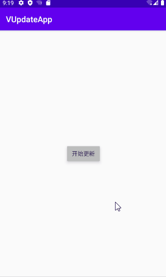

# VUpdateApk [](https://jitpack.io/#vi1zen/VUpdateApp)

VUpdateApk是一个能帮助你轻松完成版本更新的库。

# Preview


# Dependency
step1.
```
allprojects {
    repositories {
        ...
        maven { url 'https://jitpack.io' }
    }
}
```

step2.
```
implementation 'com.github.vi1zen:VUpdateApp:v1.0.0'
```

# Usage
```
AppUpdate(context).url("https://cdn.zuhao.com/static/down/app/android/app-zuhao-release.apk")//下载链接
            .apkPath() //下载文件保存的路径(可选，不填下载到默认路径)
            .start(object : DownloadListener{ //下载监听
                override fun onProgress(totalBytesRead: Long, contentLength: Long, progress: Int) {
                    updateDialog.setMessage("下载进度$progress")
                }
                override fun onSuccess() {
                    appUpdate.install()
                }
                override fun onFailure() {
                    updateDialog.setMessage("安装包下载失败")
                }
                override fun onCancel() {
                    Toast.makeText(this@MainActivity,"下载已取消",Toast.LENGTH_SHORT).show()
                }
            })
```

# Update log

+ v1.0.0
   - 提交代码

# Licence
MIT License

Copyright (c) 2020 vi1zen

Permission is hereby granted, free of charge, to any person obtaining a copy
of this software and associated documentation files (the "Software"), to deal
in the Software without restriction, including without limitation the rights
to use, copy, modify, merge, publish, distribute, sublicense, and/or sell
copies of the Software, and to permit persons to whom the Software is
furnished to do so, subject to the following conditions:

The above copyright notice and this permission notice shall be included in all
copies or substantial portions of the Software.

THE SOFTWARE IS PROVIDED "AS IS", WITHOUT WARRANTY OF ANY KIND, EXPRESS OR
IMPLIED, INCLUDING BUT NOT LIMITED TO THE WARRANTIES OF MERCHANTABILITY,
FITNESS FOR A PARTICULAR PURPOSE AND NONINFRINGEMENT. IN NO EVENT SHALL THE
AUTHORS OR COPYRIGHT HOLDERS BE LIABLE FOR ANY CLAIM, DAMAGES OR OTHER
LIABILITY, WHETHER IN AN ACTION OF CONTRACT, TORT OR OTHERWISE, ARISING FROM,
OUT OF OR IN CONNECTION WITH THE SOFTWARE OR THE USE OR OTHER DEALINGS IN THE
SOFTWARE.


